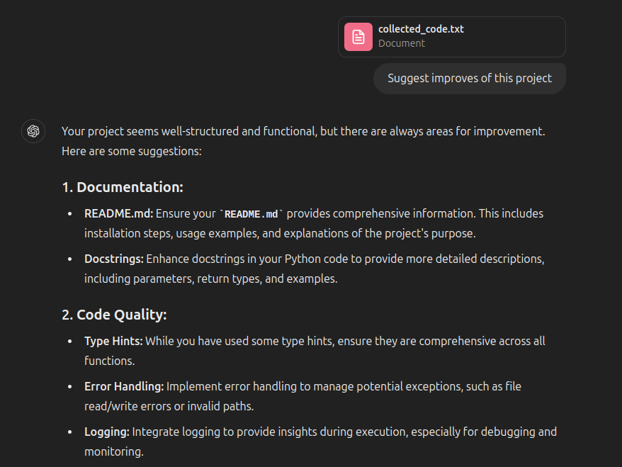

# CodeCollector

Send all your project code to GPT and enjoy!



## Overview

CodeCollector is a command-line tool that helps developers gather and consolidate code from various files and
directories into a single text file. This is particularly useful for passing entire projects to GPT models for code
analysis, refactoring, or documentation.

## Features

- Recursively collect code from specified directories and files.
- Build a project structure.
- Filter files by specified formats.
- Ignore specific files and directories.
- Output all collected code into a single text file.

## Installation

To use CodeCollector, you need to have Docker and Docker Compose installed on your system.

1. Clone this repository:

    ```sh
    git clone https://github.com/yourusername/CodeCollector.git
    cd CodeCollector
    ```

2. Build the Docker image:

    ```sh
    docker-compose build
    ```

## Usage

You can run CodeCollector using Docker Compose with various options to customize the behavior of the tool.

### Basic Usage

To collect code from specific directories and files:

```sh
docker-compose run code_collector ./your_directory
```

### Options

* `--formats` or `-f`: Specify file formats to include. By default, all formats are collected.
* `--ignore-paths` or `-i`: Specify paths to ignore. By default, only hidden files
  are ignored.
* `--output` or `-o`: Specify the output file. By default, the output file is `collected_code.txt`.

### Example

To collect code from multiple directories, including only Python and JavaScript files, ignoring specific files and
directories, and outputting to a custom file:

```shell
docker-compose run code_collector \
my_directory another_directory specific_file.py \
-f .py \
-f .js \
-i ignore_this.py\
-i ignore_this_directory \
-o output.txt
```

### Example Output

```
Project Structure:
my_directory/
    ├── file1.py
    └── file2.js
another_directory/
    └── subdir/
        └── file3.py
specific_file.py

Code Files:
================
Filepath: my_directory/file1.py
<code of file1.py>
================
Filepath: my_directory/file2.js
<code of file2.js>
================
Filepath: another_directory/subdir/file3.py
<code of file3.py>
================
Filepath: specific_file.py
<code of specific_file.py>
================
```

## License

This project is licensed under the MIT license.
